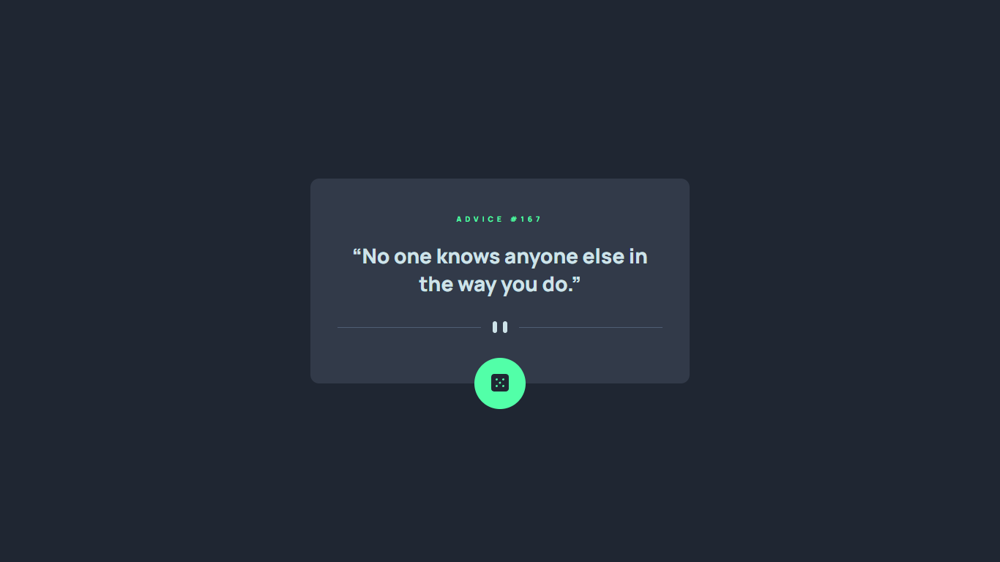
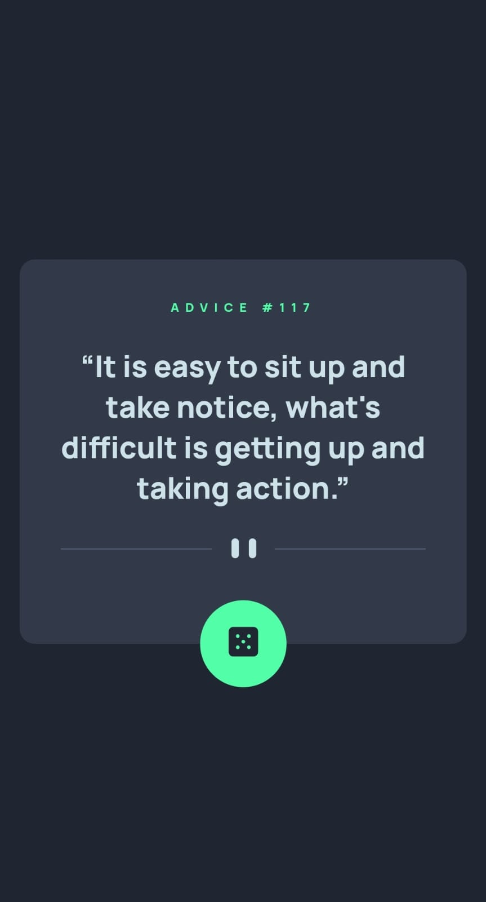

# Frontend Mentor - Advice generator app

# Table of contents

-   [Overview](#overview)
    -   [The challenge](#the-challenge)
    -   [Screenshot](#screenshot)
    -   [Links](#links)
-   [My process](#my-process)
    -   [Built with](#built-with)
    -   [What I learned](#what-i-learned)
-   [Author](#author)

# Overview

## The challenge

The challenge is to build out this advice generator app using the [Advice Slip API](https://api.adviceslip.com) and get it looking as close to the design as possible.

Users should be able to:

-   View the optimal layout for the app depending on their device's screen size
-   See hover states for all interactive elements on the page
-   Generate a new piece of advice by clicking the dice icon

# Screenshot

# Links

-   Solution URL: [Solution](https://github.com/TerminalEagle/NFT-Preview-Card)
-   Live Site URL: [Live Site](https://terminaleagle.github.io/NFT-Preview-Card/)

# My process

## Built with

-   Semantic HTML5 markup
-   CSS custom properties
-   React - JS library
-   Mobile-first workflow

## What I learned

This is my first **real** project that I have completed using React which I started learning a few days ago.

The project also provids a level of accessibility features, which I did not look into in my previous projects. I still have a long way to go in both my HTML, CSS and other skills but I think it's a start.

## Useful resources

I used the [CSS snippet developed by Josh Cameau](https://www.joshwcomeau.com/snippets/react-components/visually-hidden/) to hide the elements meant for providing accessibilty.

## Author

-   Frontend Mentor - [@TerminalEagle](https://www.frontendmentor.io/profile/TerminalEagle)
